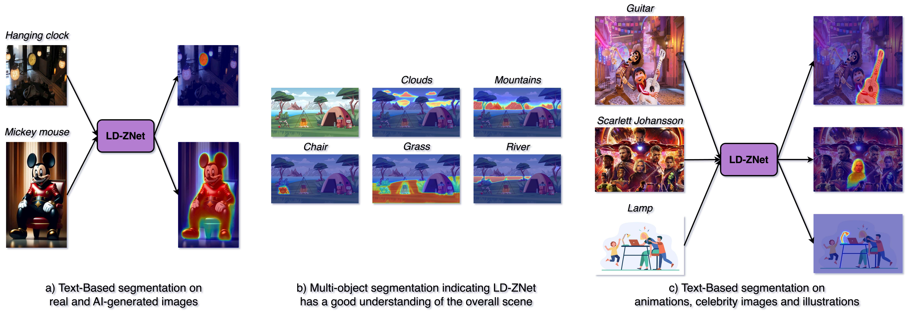
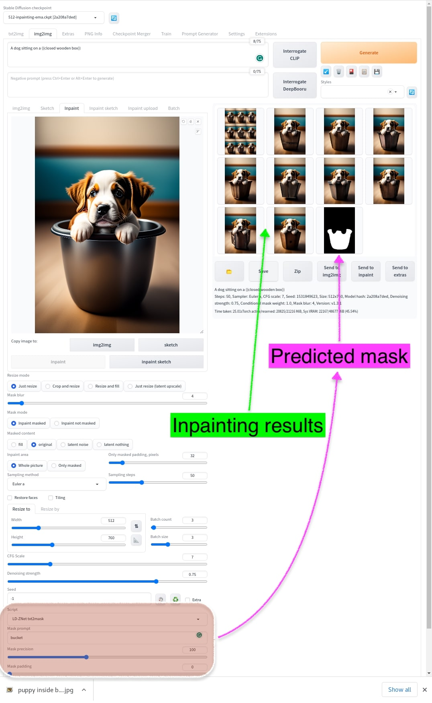

# LD-ZNet: A Latent Diffusion Approach for Text-Based Segmentation
This is the official repository for the project titled "LD-ZNet: A Latent Diffusion Approach for Text-Based Segmentation". The website for this project is https://koutilya-pnvr.github.io/LD-ZNet/.

<p align="center">
:fire: Please remember to :star: this repo if you find it useful and <a href="https://github.com/koutilya-pnvr/LD-ZNet#scroll-citation">cite</a> our work if you end up using it in your work! :fire:
</p>
<p align="center">
:fire: If you have any questions or concerns, please create an issue :memo:! :fire:
</p>

<p align="center">
  
</p>

## :book: Abstract

We present a technique for segmenting real and AI-generated images using latent diffusion models (LDMs) trained on internet-scale datasets. First, we show that the latent space of LDMs (z-space) is a better input representation compared to other feature representations like RGB images or CLIP encodings for text-based image segmentation. By training the segmentation models on the latent z-space, which creates a compressed representation across several domains like different forms of art, cartoons, illustrations, and photographs, we are also able to bridge the domain gap between real and AI-generated images. We show that the internal features of LDMs contain rich semantic information and present a technique in the form of LD-ZNet to further boost the performance of text-based segmentation. Overall, we show up to 6% improvement over standard baselines for text-to-image segmentation on natural images. For AI-generated imagery, we show close to 20% improvement compared to state-of-the-art techniques.

## :file_folder: AIGI Dataset

Next, we were mainly focused on understanding the generalization of text-based segmentation methods on AI-images because of the traction the AI-generated content gained in the past couple of years. Moreover, several editing workflows such as inpainting require precise segmentation of objects in the image. Thus it becomes important to understand the generalization ability of the computer vision systems to AI-content. Hence we create an AI-generated dataset named AIGI that contains 100 AI-generated images gathered from the <a href="https://lexica.art/" target="_blank" rel="noopener noreferrer">lexica.art website</a> and 214 object instances labeled along with their categorical captions as shown below. We also make this dataset public for future research in this direction.

The AIGI dataset is made available at https://drive.google.com/drive/u/1/folders/1oZDJu5Y7nqN23Fcb6kCvXy1Do69l_YkQ.

 
## :sparkles: Pretrained Models

The pretrained model for LD-ZNet can be found here: 

## :eyes: LD-ZNet Demo in Automatic1111 stable-diffusion-webui

We integrate our LD-ZNet demo into automatic1111 GUI for the users to run the demo locally. The users can download the LD-ZNet model from above and clone this repo using the extensions tab from the WebUI.

<div class="fig-row has-text-centered">
    <figure class="fig-col fig1-2" id="js--f99-01">

<!--         <figcaption>Figure 99.2 &emsp; Tall image</figcaption> -->
    </figure>
    <figure class="fig-col fig1-2" id="js--f99-02">

<!--         <figcaption>Figure 99.3 &emsp; short image</figcaption> -->
    </figure>
  <figure class="fig-col fig1-2" id="js--f99-03">

<!--         <figcaption>Figure 99.3 &emsp; short image</figcaption> -->
    </figure>
</div>

Given a generated image obtained from SD 2.1, we replace the "bucket" with a "closed wooden box" via the inpainting mechanism in the stable-diffusion-webui. For this, the first step is to segment the bucket via our LD-ZNet through the provided demo script in the img2img tab of the webui. The predicted mask from the LD-ZNet and the subsequent inpainting results replaced the bucket pixels with a "closed wooden box" are shown above.

## :scroll: Citation
If you find our [paper]([https://arxiv.org/abs/2303.12059](https://openaccess.thecvf.com/content/ICCV2023/papers/PNVR_LD-ZNet_A_Latent_Diffusion_Approach_for_Text-Based_Image_Segmentation_ICCV_2023_paper.pdf)) or this toolbox useful for your research, please cite our work.

```
@InProceedings{PNVR_2023_ICCV,
    author    = {PNVR, Koutilya and Singh, Bharat and Ghosh, Pallabi and Siddiquie, Behjat and Jacobs, David},
    title     = {LD-ZNet: A Latent Diffusion Approach for Text-Based Image Segmentation},
    booktitle = {Proceedings of the IEEE/CVF International Conference on Computer Vision (ICCV)},
    month     = {October},
    year      = {2023},
    pages     = {4157-4168}
}
```
